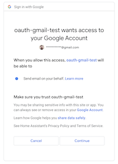

A demo, with limited scope, allowing a local application to send emails on behalf of your personal gmail account.

Running this demo opens the following prompt:



Upon authorization a test email is sent on the recipients behalf ("me") to the `emailTo` address (MUST UPDATE BEFORE RUNNING!).

Note: I believe there is a low(er) quota on sending gmail messages this way. Do not use for bulk sending.

## TODO

- consider embedding the clientID/secret in the app "not secret" (https://stackoverflow.com/a/73779731) for OSS

## Setup

- GCP oauth consent page
- Oauth desktop app cred generate
- Download credentials ($HOME/credentials.json) and stash securely
- `chmod 600 /path/to/your/credentials.json`

## Run

```
# export oauth clientID/secret info
export CREDENTIALS_JSON_PATH="$HOME/credentials.json"

# export recipient
export EMAIL_TO="EMAIL@ADDRESS.COM"

# run the app (opens browser to log in, or add `--no-browser` to copy/paste)
go run main.go

# token stays in memory, an authorization call is made each time via browser
```

## Debug

The following error message appears generally when the `emailTo` field isn't updated in main.go.

```
Unable to send email googleapi: Error 400: Invalid To header, invalidArgument
exit status 1
```